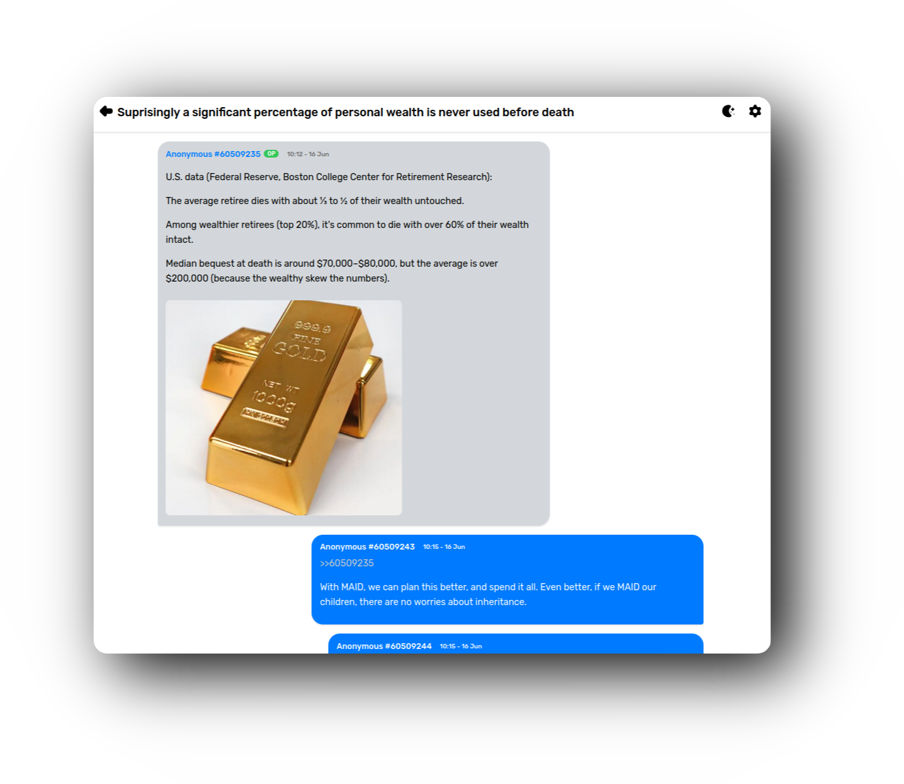

<p align="center">
  
</p>

<p align="center">
  <a href="https://user7210unix.github.io/ichan/"><strong>Live Demo</strong></a> •
  <a href="https://cors-anywhere.herokuapp.com/corsdemo">Get Access</a> •
  <a href="#installation">Installation</a> 
</p>

<p align="center">
  
  
  
</p>

<div align="center">

## Overview

<div align="left">

**iChan** is a modern, iMessage-inspired 4chan client built with HTML, CSS, and JavaScript. It features a touch-friendly, responsive interface, offline caching, dark mode, and intuitive navigation for browsing boards and threads. Designed for both mobile and desktop users, iChan delivers a clean and engaging experience with subtle animations and a minimalistic aesthetic.

<div align="center">

## Features

<div align="left">

- **iMessage-Inspired UI**: Sleek, minimal design mimicking the look and feel of iMessage.
- **Touch-Friendly**: Fully responsive for seamless use on mobile and desktop devices.
- **Thread Navigation**: View threads with replies styled in blue on the right; click `>>` links to jump to specific posts.
- **Board & Thread Search**: Browse boards and threads effortlessly (server-side setup required for search).
- **Offline Caching**: Cache boards and threads locally for offline access using local storage.
- **Dark Mode**: Toggle between light and dark themes with a stylish sun/moon icon.
- **Parallax Scrolling**: Subtle background effects for a smooth scrolling experience.
- **Timestamps**: Posts display time in 24-hour format, with dates for older entries (e.g., `22:35 - 25 April`).

<div align="center">

## Showcase

<div align="left">

<p align="center">
  
</p>

<div align="left">

> **Note**: GitHub does not render images directly in README previews. To view images, clone the repository and run the site locally or visit the [live demo](https://user7210unix.github.io/ichan/).

## Installation

To run iChan locally, follow these steps:

1. **Clone the repository**:
   ```bash
   git clone https://github.com/user7210unix/ichan.git
   cd ichan
   ```
<div align="center">
  
### Made with ❤️ by user7210unix
