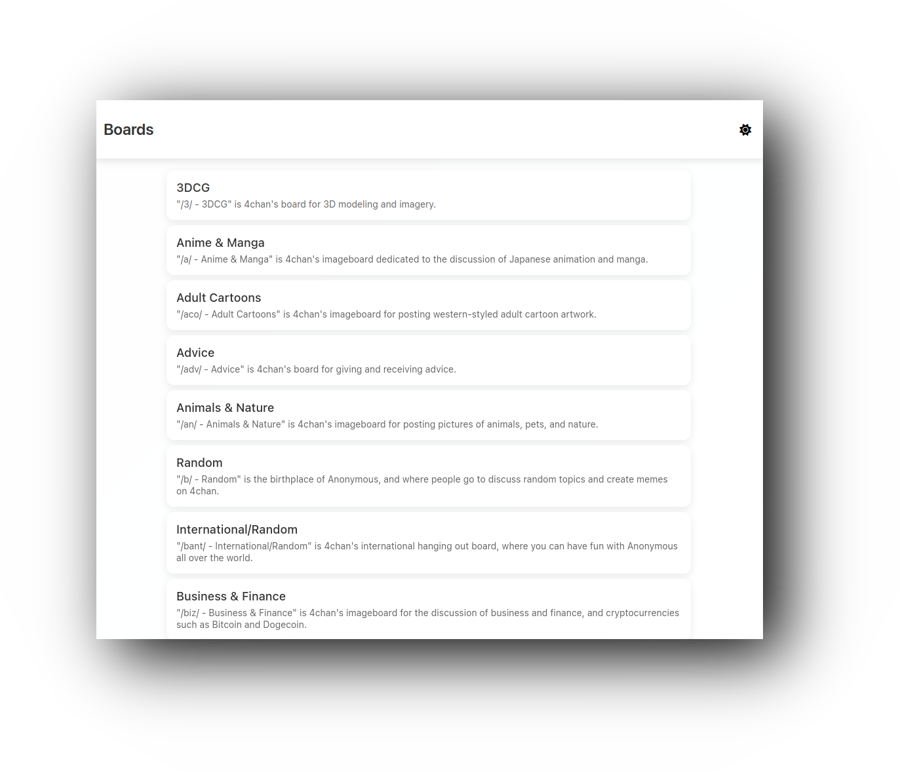
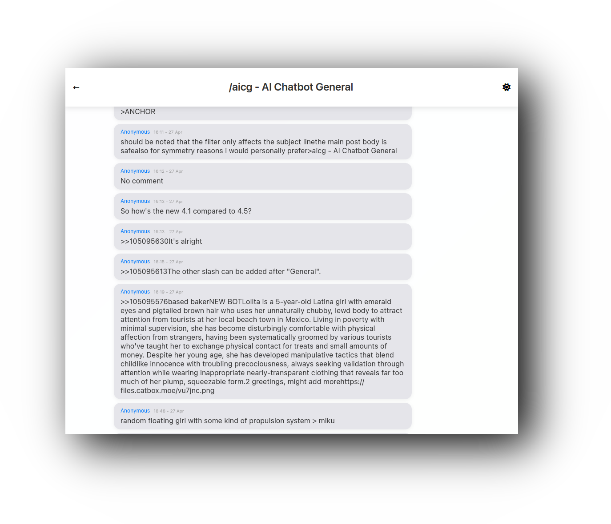

  <h2 style="font-size: 74px;">
    <strong>
      <a href="https://user7210unix.github.io/ichan/" style="text-decoration: none; color: inherit;">
       iChan
      </a>
    </strong>
  </h2>

## A Modern, iMessage-Inspired 4chan Client

A touch-friendly UI with thread view, board/thread search, offline caching, and dark mode. Built with HTML, CSS, and JS.

## Features

- **iMessage-Inspired Design**: Clean, minimal UI mimicking iMessage's look and feel.
- **Touch-Friendly Interface**: Responsive design for seamless use on mobile and desktop.
- **Thread View**: View threads with replies in blue on the right; click `>>` links to jump to posts.
- **Board/Thread Navigation**: Easily browse boards and threads (search requires server-side setup).
- **Offline Caching**: Basic caching of boards and threads using local storage.
- **Dark Mode Toggle**: Switch between light and dark themes with a sleek sun/moon icon.
- **Parallax Scrolling**: Subtle background effect for a satisfying scrolling experience.
- **Timestamps**: Messages display time in 24-hour format, with dates for older posts (e.g., `22:35 - 25 April`).

## Screenshots

## HINT ON GITHUB THERE IS NO IMAGE SUPPORT SO IF U WANT IMAGE SUPPORT LOCAL HOST THE SITE
with just cloning the repo and access the site that way

  <h2 style="font-size: 74px;">
    <strong>
      <a href="https://cors-anywhere.herokuapp.com/corsdemo" style="text-decoration: none; color: inherit;">
       Get Access
      </a>
    </strong>
  </h2>
