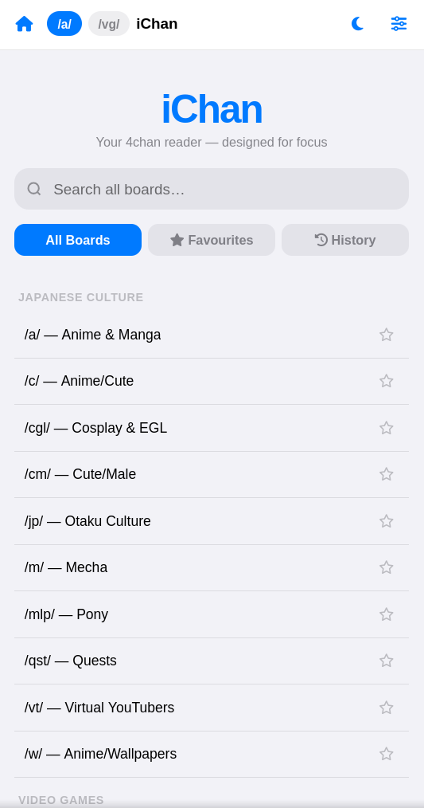
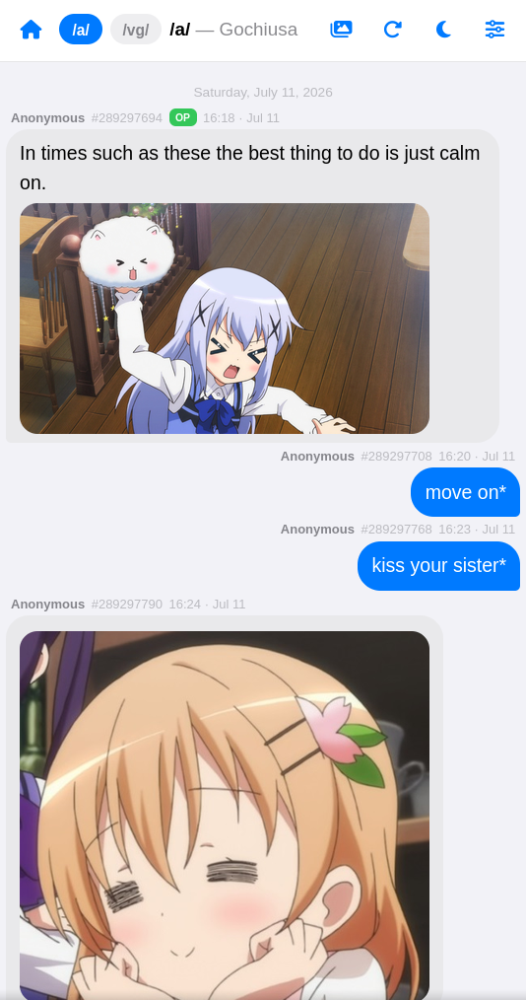
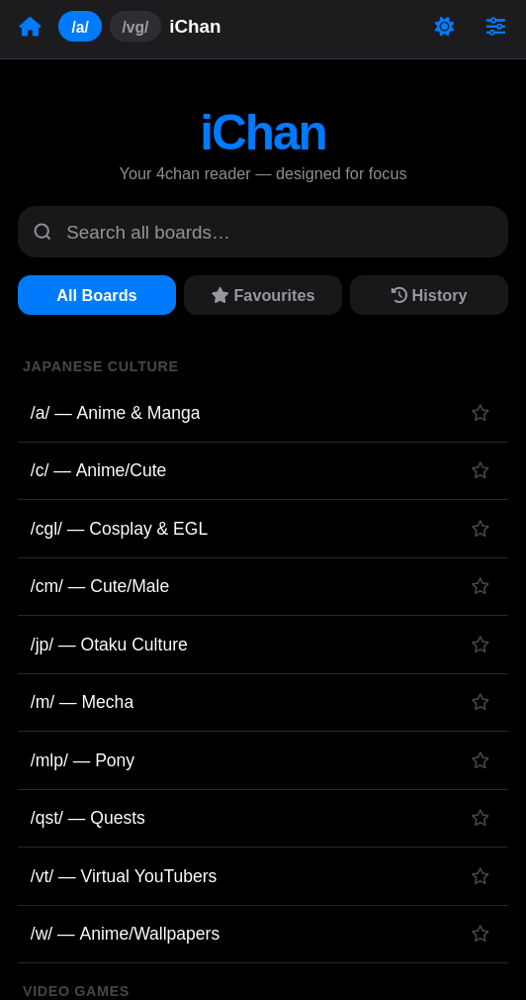
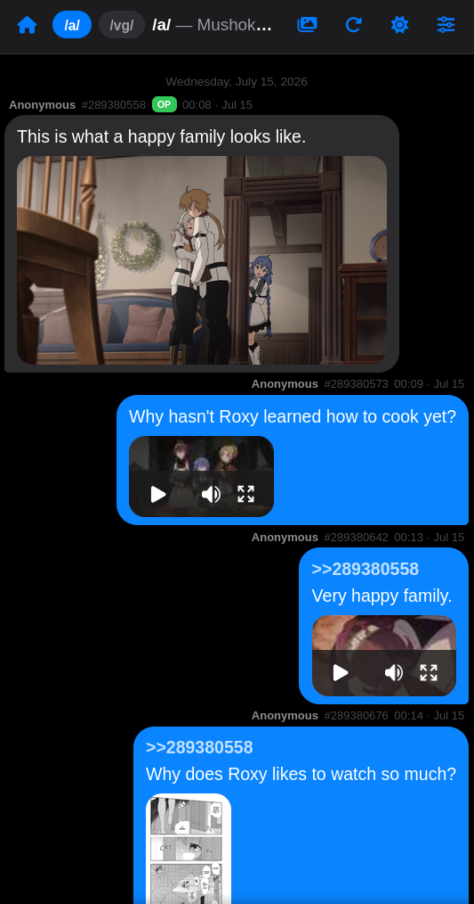
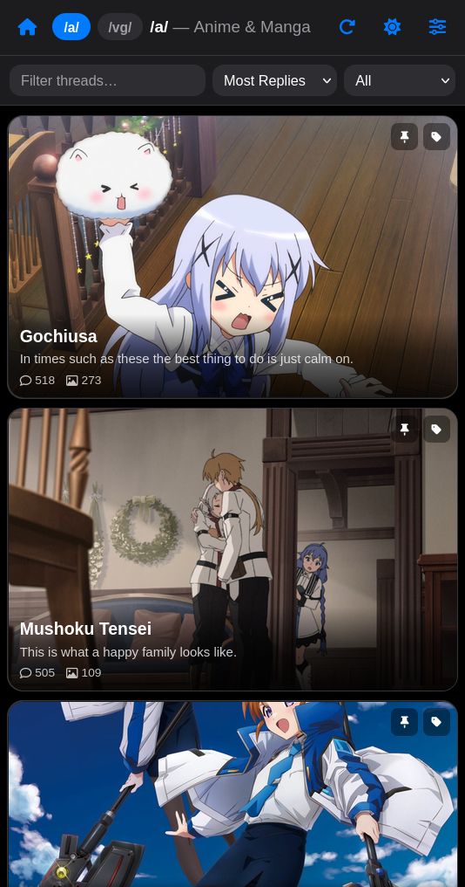

# iChan

A minimal, chat-style reader for 4chan. Threads read like conversations, catalogs read like a feed, and the whole thing is built to feel native on a phone.

**[user7210unix.github.io/ichan](https://user7210unix.github.io/ichan/)**

  
  
  
  
  

## What it is

Most 4chan front ends are built around the imageboard's original layout — reply chains, quote links, and a wall of thumbnails. iChan keeps that structure but presents it differently: threads render as a message stream with grouped bubbles and quote context, and the board catalog is laid out as a compact, image-led list rather than a grid of boxes.

## Interface

- **Boards** — grouped by category, searchable, with favourites and recent history kept locally.
- **Catalog** — one thread per row, full-bleed thumbnail, subject and comment preview over a gradient scrim, sized for a quick scroll rather than a wall of thumbnails.
- **Thread view** — posts as chat bubbles, quote references shown inline above the reply that made them, images and video loaded full size in place.
- **Gallery** — every image or video in a thread, browsable from one button in the header, independent of scrolling through posts.
- **Settings** — dark mode, OLED black, adjustable type size, an indented tree view for reply chains, thread tagging, pinning, and pattern-based filters for names, tripcodes, subjects, or comments.

Filters remove matching posts and threads outright rather than dimming them — filtered content does not render at all.

## Notes

- All data comes from 4chan's public read API. iChan is a client; it does not host, cache, or modify any content.
- Everything — favourites, history, tags, filters, and settings — is stored locally in the browser. Nothing is sent anywhere except the requests needed to load boards, threads, and media.
- This project is unaffiliated with 4chan.

## License

MIT
